<a href="https://github.com/Thaskow">
  <picture>
    <source media="(prefers-color-scheme: dark)" srcset="assets/header-dark.svg" />
    
  </picture>
</a>

  
  
  

 

<a href="https://cstonx.thaskow.fr">
  <picture>
    <source media="(prefers-color-scheme: dark)" srcset="assets/cstonx-dark.svg" />
    
  </picture>
</a>

  
  
  

 

<a href="https://kuma.thaskow.fr/status/cstonx">
  <picture>
    <source media="(prefers-color-scheme: dark)" srcset="assets/live-dark.svg" />
    
  </picture>
</a>

 
 

<table>
  <tr>
    <td width="50%" valign="top">
      <h3>🧰 Things I code with</h3>
        
      
    </td>
    <td width="50%" valign="top">
      <h3>🏠 What I self-host</h3>
        
      
One VPS, rebuilt from code in a single command: Docker Compose services behind Nginx and Authelia SSO, monitored with Uptime Kuma and Beszel, with nightly backups and restore tests.

    </td>
  </tr>
</table>

 

<picture>
  <source media="(prefers-color-scheme: dark)" srcset="assets/activity-dark.svg" />
  
</picture>

<picture>
  <source media="(prefers-color-scheme: dark)" srcset="assets/snake-dark.svg" />
  
</picture>

<picture>
  <source media="(prefers-color-scheme: dark)" srcset="assets/footer-dark.svg" />
  
</picture>
