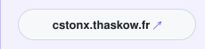
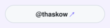
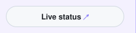
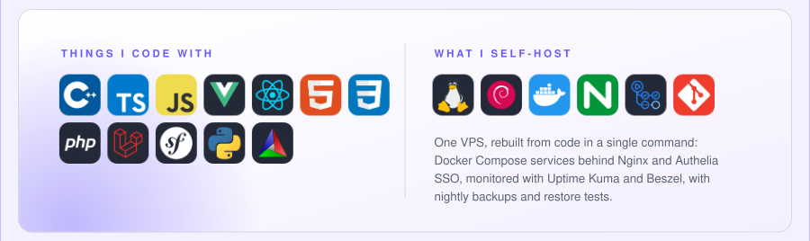

<a href="https://github.com/Thaskow"><picture><source media="(prefers-color-scheme: dark)" srcset="assets/header-dark.svg" /></picture></a>
<a href="https://cstonx.thaskow.fr"><picture><source media="(prefers-color-scheme: dark)" srcset="assets/link-0-dark.svg" /></picture></a><a href="https://github.com/CStonx/download/releases/latest"><picture><source media="(prefers-color-scheme: dark)" srcset="assets/link-1-dark.svg" /></picture></a><a href="https://x.com/thaskow"><picture><source media="(prefers-color-scheme: dark)" srcset="assets/link-2-dark.svg" /></picture></a><a href="https://kuma.thaskow.fr/status/cstonx"><picture><source media="(prefers-color-scheme: dark)" srcset="assets/link-3-dark.svg" /></picture></a>
<a href="https://cstonx.thaskow.fr"><picture><source media="(prefers-color-scheme: dark)" srcset="assets/cstonx-dark.svg" /></picture></a>
<a href="https://kuma.thaskow.fr/status/cstonx"><picture><source media="(prefers-color-scheme: dark)" srcset="assets/live-dark.svg" /></picture></a>
<picture><source media="(prefers-color-scheme: dark)" srcset="assets/stack-dark.svg" /></picture>
<picture><source media="(prefers-color-scheme: dark)" srcset="assets/activity-dark.svg" /></picture>
<picture><source media="(prefers-color-scheme: dark)" srcset="assets/footer-dark.svg" /></picture>
