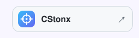
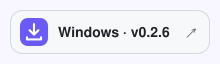
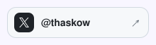
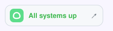

<a href="https://github.com/Thaskow"><picture><source media="(prefers-color-scheme: dark)" srcset="assets/dist/header-dark-4771eaafb4.svg" /></picture></a>
<a href="https://cstonx.thaskow.fr"><picture><source media="(prefers-color-scheme: dark)" srcset="assets/dist/link-0-dark-cb745ef829.svg" /></picture></a><a href="https://github.com/CStonx/download/releases/latest"><picture><source media="(prefers-color-scheme: dark)" srcset="assets/dist/link-1-dark-7d09893429.svg" /></picture></a><a href="https://x.com/thaskow"><picture><source media="(prefers-color-scheme: dark)" srcset="assets/dist/link-2-dark-85836f984a.svg" /></picture></a><a href="https://kuma.thaskow.fr/status/cstonx"><picture><source media="(prefers-color-scheme: dark)" srcset="assets/dist/link-3-dark-5080ee10ad.svg" /></picture></a>
<a href="https://cstonx.thaskow.fr"><picture><source media="(prefers-color-scheme: dark)" srcset="assets/dist/cstonx-dark-d77fca317a.svg" /></picture></a>
<a href="https://kuma.thaskow.fr/status/cstonx"><picture><source media="(prefers-color-scheme: dark)" srcset="assets/dist/live-dark-dd5e0e772b.svg" /></picture></a>
<picture><source media="(prefers-color-scheme: dark)" srcset="assets/dist/stack-dark-3d684d9b7d.svg" /></picture>
<picture><source media="(prefers-color-scheme: dark)" srcset="assets/dist/activity-dark-461e8bd063.svg" /></picture>
<picture><source media="(prefers-color-scheme: dark)" srcset="assets/dist/footer-dark-c505734ec6.svg" /></picture>
